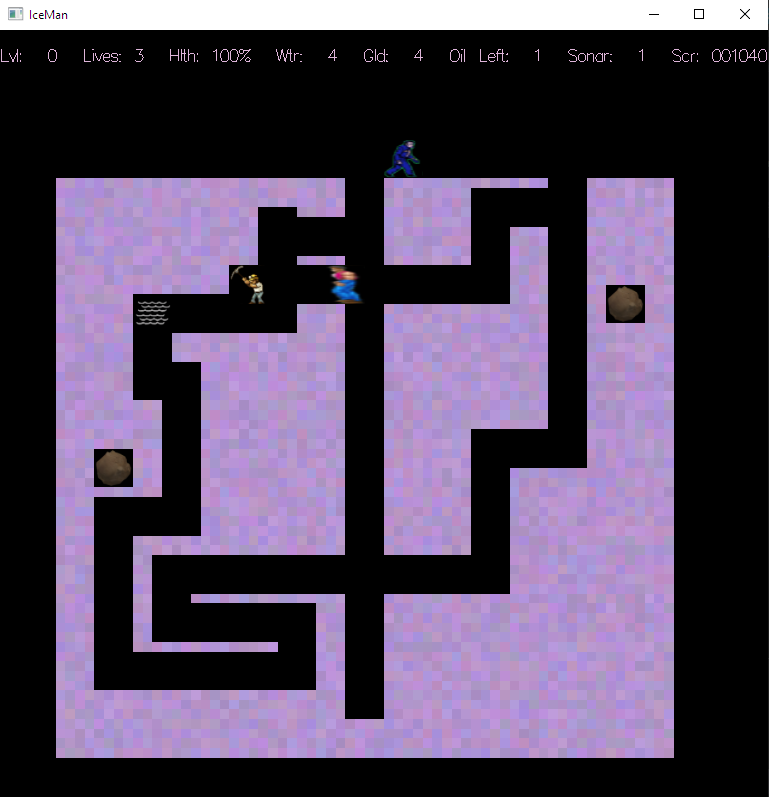

# IceMan

ABOUT
------
IceMan is a Dig Dug clone written in C++.  I programmed the enemy AI, level randomization, other game mechanics, characters, and objects. The engine, gameplay loop, animation, art, and controls were provided by Professor Russell.

GAMEPLAY
--------

Use the arrow keys (or 8426 or wasd) to move, the space bar to squirt, and the tab key to drop a gold nugget. Press the Z key to use the sonar. You can hit Escape to sacrifice a life and restart the current level. You can type q to quit the game prematurely. Hitting the f key pauses the game; hitting any key after that takes one action step, except that hitting the r key resumes regular play.

In Iceman, the player has to dig underground tunnels through an oil field looking for oil. After the player has gathered all available oil within a particular field, the level is completed and the player advances to a new, more difficult oil field. The player starts out a new game with three lives and continues to play until all of his/her lives have been exhausted. There are multiple levels in Iceman, beginning with level 0, and each level has its own unique oil field configuration.

Unfortunately, a band of Regular and Hardcore Protesters roam around the oil field and shout at the Iceman any time they get near to him. Each time the Iceman is shouted at, he becomes more irritated and less healthy, and eventually, he gives up and quits (loses a life). At this point, if the Iceman has more lives, the player can continue the game on the current level. If not, the game is over.

The Iceman may also shoot their squirt gun by pressing the space bar. Squirts from the squirt gun will temporarily stun the Protesters. A Protester who is sufficiently irritated (their hit points go to zero) will leave the oil field out of frustration. Occasionally, Water Pools will randomly bubble up within the tunnels, and the Iceman can move onto them to use this water to refill the squirt gun. But beware – a Water Pool disappears quickly back into the tunnel’s ice.

The Iceman will also discover Gold Nuggets randomly distributed throughout the oil field. He can use them to bribe the Protesters by dropping a Nugget in front of a Protester. If a Protester runs into such dropped gold, it will pick it up and accept it as a bribe. A bribed Regular Protester leaves the oil field immediately. However, a Hardcore Protester simply pockets the gold and after briefly stopping to gloat over this new treasure, resumes the hunt to protest against the Iceman. If the player drops a Gold Nugget and it’s not picked up quickly, it will sink into the muck of the oil field, never to be discovered again.

Iceman can also cause Boulders to drop on them. If the Iceman digs all of the ice supporting a Boulder from underneath it, then after a short delay, the Boulder will fall until it crashes into the ice or another Boulder below. A Protester who is bonked by a Boulder as it falls becomes so irritated that it will immediately leave the oil field. But beware, the Iceman is also susceptible to being bonked. If the Iceman is bonked, he also becomes super irritated (lose all of his hit points), and the level will end. If the player still has lives remaining, the level is restarted.

Of course, the Iceman is not alone – friends of the Iceman will occasionally drop new Sonar Kits in the upper-left corner of the oil field for the Iceman to pick up. If the Iceman has one or more sonar charges in his inventory, the player can press the Z key to use a charge to map the contents of the oil field within an extended radius around them, eliminating the need to dig into the ice to determine its contents. The Iceman also starts out with one sonar charge at the start of each level.
